<p align="center">
  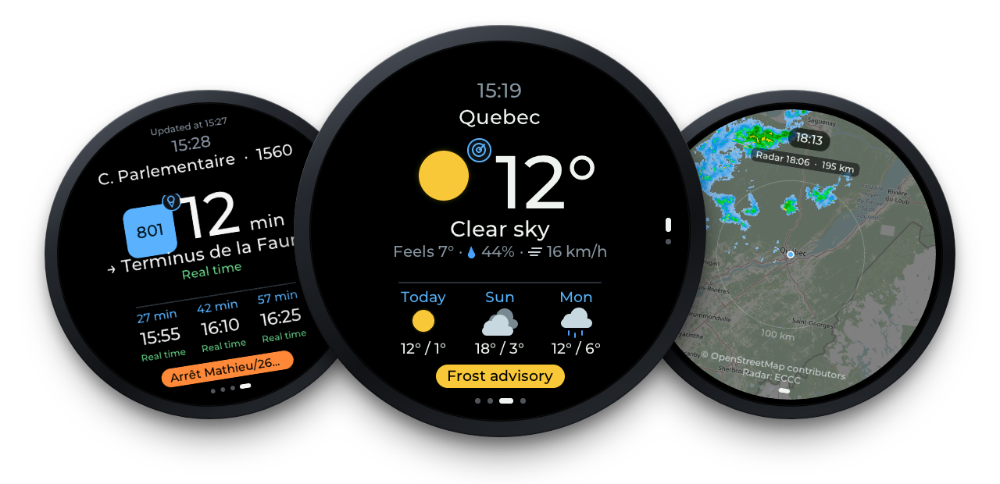
</p>

<h1 align="center">MeteoBus</h1>

<p align="center">
  <b>Firmware for the Waveshare ESP32-S3-Touch-AMOLED-1.75</b><br>
  Local weather, an hourly forecast, a live rain radar and your Québec City bus stops' next departures (RTC) on a
  round AMOLED screen. No API keys needed.
</p>

<p align="center">
  <a href="https://github.com/TheMonkeyz/esp32-s3-meteobus/releases/latest"></a>
  <a href="https://github.com/TheMonkeyz/esp32-s3-meteobus/actions/workflows/firmware.yml"></a>
  <a href="LICENSE"></a>
</p>

<p align="center">
  <a href="https://themonkeyz.github.io/esp32-s3-meteobus/"><b>Install in your browser</b></a> ·
  <a href="https://github.com/TheMonkeyz/esp32-s3-meteobus/releases">Releases</a> ·
  <a href="CHANGELOG.md">Changelog</a> ·
  <a href="docs">Docs</a>
</p>

<p align="center">
  🇨🇦 Français : <a href="docs/guide.fr.md">guide</a> et
  <a href="https://themonkeyz.github.io/esp32-s3-meteobus/?lang=fr">outil d'installation</a> ·
  ᐃᓄᒃᑎᑐᑦ: <a href="https://themonkeyz.github.io/esp32-s3-meteobus/?lang=iu">web flasher in Inuktitut (draft)</a>
</p>

<table align="center">
  <tr>
    <td align="center">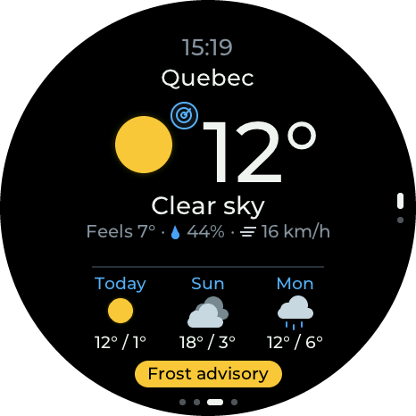<br><a href="#weather-screen"><b>Weather</b></a><br><sub>Now, the next 2 h and 3 days</sub></td>
    <td align="center">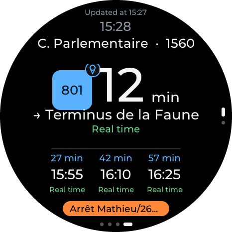<br><a href="#buses"><b>Buses</b></a><br><sub>Your RTC stops' next departures</sub></td>
    <td align="center">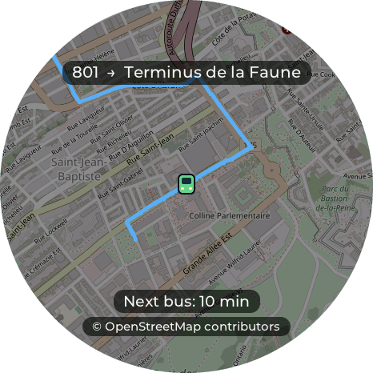<br><a href="#bus-map"><b>Bus map</b></a><br><sub>The route and its buses, live</sub></td>
    <td align="center">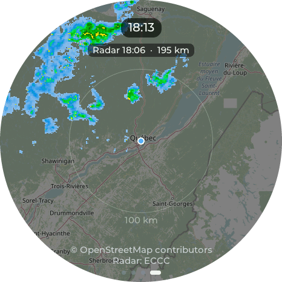<br><a href="#radar"><b>Radar</b></a><br><sub>Rain and lightning, 3-hour loop</sub></td>
  </tr>
  <tr>
    <td align="center">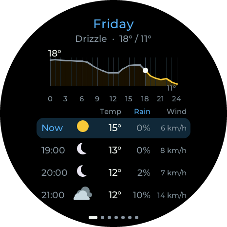<br><a href="#hourly-view"><b>Hourly view</b></a><br><sub>7 days, hour by hour</sub></td>
    <td align="center"><br><a href="#extras"><b>Extras</b></a><br><sub>Sun, UV, moon, air quality</sub></td>
    <td align="center">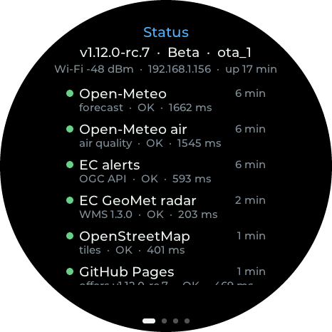<br><a href="#status"><b>Status</b></a><br><sub>Version, Wi-Fi, online services</sub></td>
    <td align="center"><br><a href="#on-the-display"><b>Settings</b></a><br><sub>Press and hold any main screen</sub></td>
  </tr>
</table>

MeteoBus joins two earlier projects for the same board: the weather display
([esp32-s3-weather](https://github.com/TheMonkeyz/esp32-s3-weather), which it started from, at v1.15.0) and the RTC
bus display ([esp32-s3-rtcquebec](https://github.com/TheMonkeyz/esp32-s3-rtcquebec)).

## 🧰 What you need

- A **Waveshare ESP32-S3-Touch-AMOLED-1.75**: ESP32-S3 with 16 MB flash and 8 MB PSRAM, 1.75" round AMOLED
  (466×466 CO5300 panel), CST9217 touch. The firmware also uses its two microphones (presence dimming), its speaker
  (alert sounds) and its motion sensor (wake on pick-up).
- A **USB-C data cable** and a computer with **Chrome or Edge** for the first install.
- A **Wi-Fi network** with internet access, and a **phone** for the Wi-Fi setup and the settings page. The ESP32-S3
  only has 2.4 GHz Wi-Fi.
- No accounts and no API keys. Where the data comes from, and where it's available: see
  [Data sources](#-data-sources).

## 🔌 Install

Open the **[web flasher](https://themonkeyz.github.io/esp32-s3-meteobus/)** in Chrome or Edge on a computer, plug in
the display with a USB-C data cable, and follow the steps. It has two channels: **Stable** (the latest release) and
**Beta** (a release candidate, offered only while it's newer than the latest release).

> [!TIP]
> Tick **Erase device** the first time. Leave it unticked for updates, to keep Wi-Fi and settings. An erased display
> starts like a new one: Wi-Fi setup, the built-in place (Québec City) until you choose yours, a new settings
> certificate (the phone warns once again) and a new settings key, and the radar maps download again.

Other ways:

- Ready-made images are also attached to each [release](https://github.com/TheMonkeyz/esp32-s3-meteobus/releases).
  The release notes give the esptool commands: the full image for a first install (erases saved settings), or the
  separate parts for an update that keeps them.
- On Windows, from your own build: see [Flashing on Windows](#flashing-on-windows).
- Once installed, the display updates itself over Wi-Fi: see [Updates over Wi-Fi](#-updates-over-wi-fi).

If the computer can't find the board, hold **BOOT**, tap **RESET**, release **BOOT**, then try again.

## 📶 First-time setup

1. Install the firmware (see [Install](#-install)). With no Wi-Fi saved, the screen shows **Wi-Fi setup** and a QR
   code.
2. Scan the QR code to join the display's network **MeteoBus-Setup**. Its password is shown under the code: each
   display has its own.
3. The phone's **"Sign in to network"** page opens by itself (captive portal) and shows the setup page with the Wi-Fi
   section on top. If it doesn't, open **http://192.168.4.1**.
4. The page scans automatically and lists nearby networks (strongest first, 🔒 = password needed). Tap yours, enter
   the password (**Show** reveals it while typing) and save. The display restarts and connects. **Scan again**
   refreshes the list.
5. Then choose your place and add your bus stops on the settings page (see [Settings](#-settings)). Until
   then the display shows Québec City's weather, and the buses screen says how to add stops.

### Wi-Fi without typing the password

The Wi-Fi setup screen has two pages; **swipe** to switch:

1. **Any phone:** QR code to join **MeteoBus-Setup**; the setup page opens by itself (as above).
2. **Android 10+ — Easy Connect:** with the phone connected to the Wi-Fi you want, scan the display's code (the
   camera or any QR scanner works). The phone sends that network, password included; the display saves it and
   restarts.

Browsers can't read the Wi-Fi passwords saved on a phone, and iPhones don't do Easy Connect. For iPhone, the setup
page's *Password saved on your phone? Copy it* tip explains how to copy it: Settings → Wi-Fi → ⓘ → Password → Copy.

## 📱 Using it

The main screens sit in a row: **Status · Extras · Weather · Buses**. From the weather screen, swipe **right** for
the extras page (and right again for the status page), **left** for your bus stops. Three screens open on top and
close with a **sideways swipe**: the radar (tap the weather icon), the bus map (tap a stop's route badge) and the
alert details (tap the pill at the bottom). **Press and hold** the weather screen or a stop page for Settings.

### Weather screen


Clock, place name, icon and temperature, conditions, then feels-like, humidity (blue drop) and wind (wind mark). A
line says when rain or snow starts or stops within 2 h ("Rain around 14:45"). Then the 3-day high/low with icons. At
the bottom, a pill shows a weather alert in its colour, or, without an alert, an update waiting (see
[Weather alerts](#weather-alerts)).

With several places, there is one page per place (dots on the right edge), each with its own local time.

- **Drag up/down** to change place. The page follows the finger, snaps, and bounces at the first and last.
- **Tap the weather icon** (it has a small radar badge) for the radar.
- **Tap a day** of the forecast for its hourly view.
- **Tap the pill** at the bottom for the alert's details or the update.
- **Swipe right** for the extras page, **left** for your bus stops.
- **Press and hold** for the Settings screen.

<br clear="right">

### Buses


One page per favourite stop, up to 8 (add them on the phone's settings page, **My stops**), laid out like the
weather screen: when it was updated, the clock, the stop's name and number, the route badge and the next departure
in big, the direction, whether that time is real time (the bus's GPS) or the schedule, and the three departures
after it. The page also says when a departure is cancelled, when there are no more departures today, and when the
stop isn't served for now (a detour, works) or is drop-off only.

The stop on view is asked from the RTC every 30 s while the buses are on screen; the others every 5 minutes. The
route's notices (a detour, a stop moved) show in an orange pill at the bottom: tap it for the full text (RTC
publishes it in French only).

- **Drag up/down** to change stop (dots on the right edge).
- **Tap the route badge** (it has a small map pin) for the [bus map](#bus-map).
- **Tap the orange pill** for the route's notices; swipe sideways to come back.
- **Swipe right** for the weather. **Press and hold** for Settings.

With no stops yet, the screen says how to add them: press and hold, then **Location & more (phone)**.

<br clear="right">

### Bus map


The streets around the stop (OpenStreetMap), the route's path in its direction, the stop, and the route's buses on
the way as small bus icons, refreshed every 20 s.

- **Swipe down** to zoom in, **up** to zoom out (5 steps, from the neighbourhood to a few streets). The map grows or
  shrinks under your finger at once; the sharper one replaces it a moment later, and the buses come back once it
  is still.
- **Swipe sideways** to go back to the stop (it also goes back by itself after 5 minutes untouched). Taps do nothing.

<br clear="right">

### Hourly view


7 days (the weather screen shows the first 3). For each day: weekday, conditions and high/low; the day's temperature
graph (0 to 24 h, a line every hour, high and low marked; today's past hours greyed with a dot at now); then one row
per hour: time, icon, temperature, chance of rain, wind. Today starts at the current hour ("Now").

- **Drag up/down** to scroll the hours.
- **Drag left/right** to change day. The page follows the finger and snaps.
- **Tap** to close.

<br clear="right">

### Radar


The area around the place shown: a dimmed OpenStreetMap map, Environment Canada radar, lightning of the last
10 minutes (yellow bolts), a range ring, the clock, and the radar time and radius. The last 3 hours load in a few
seconds after it opens.

- **Tap** to play the last 3 h (15 frames, 3 fps), looping for a minute (new radar images join the loop). Tap again
  to stop.
- **Swipe down** to zoom in, **up** to zoom out: ≈25 km up to ≈1,550 km radius in 7 doubling steps, animated.
- **Swipe sideways** to go back (it also goes back by itself after 5 minutes untouched).

<br clear="right">

### Extras


- Date.
- Sun arc from sunrise to sunset, with the sun at the current time (daylight length, or the next sunrise at night).
- UV index now and today's max.
- Moon phase with picture and % lit.
- Air quality (US AQI).
- Pollen when available (Open-Meteo only has it for Europe, so the row is hidden in Canada).

**Swipe left** to go back, **right** for the status page.

<br clear="right">

### Status


Swipe right twice from the weather screen.

- Firmware version, update channel and app slot.
- Wi-Fi signal, IP address and uptime.
- Every online service the display uses (Open-Meteo forecast and air quality, Environment Canada alerts and radar,
  OpenStreetMap, the RTC, GitHub Pages for updates, the time server), with a coloured dot, when it was last
  contacted, how long it took, or why it failed. Opening the page checks any service not contacted in the last
  5 min.

**Swipe left** to go back; drag to scroll.

<br clear="right">

### Weather alerts

Environment Canada watches, warnings, advisories and statements for the place shown appear in a pill at the bottom
of the weather screen, in the alert's colour (`+1` if there are more); the place name stays on top. Tap the pill for
the details: a map of the affected region on OpenStreetMap, until when, the area and the text. Drag to scroll;
swipe sideways to come back.

When an update is also waiting, the alert keeps the pill and gets a small blue dot; the alert details then end with
**Update available >**, which opens the update.

A stop's orange notices pill opens the same screen, with the RTC's notices for that route.

### Alert sounds

Warning beeps through the speaker when a new weather alert appears for the place shown: yellow 2 beeps, orange
3 + 3, red a hi-lo siren. Each alert sounds once. Choose which alerts sound, the volume and quiet hours (red still
sounds) in [Settings](#-settings).

## 🔧 Settings

Every setting is saved at once and kept across updates. The display's Settings screen has the everyday ones; the
settings page on your phone has all of them.

### On the display


**Press and hold** the weather screen or a stop page.

- **Screen:** dim when quiet, wake on pick-up, timing (Short / Normal / Long), brightness.
- **Units:** temperature, wind, clock, language (English / Français / ᐃᓄᒃᑎᑐᑦ).
- **Sound:** which alerts sound (off / red / orange and red / all), volume, a test.
- **More:** **Location & more (phone)** (the QR code for the phone page), Wi-Fi network, updates, restart.

Tap a row to switch or change it. Slide along the bottom band for brightness (it follows the finger). **Done** or a
swipe **right** closes it, back to the screen it was opened from. Restart needs two taps.

<br clear="right">

### On your phone

Press and hold the display, tap **Location & more (phone)** and scan the QR code. Your phone must be on the same
Wi-Fi. The phone warns that the certificate isn't trusted: that's expected, because the display signs its own
certificate; choose *Advanced → Proceed*. The page is served over HTTPS, which is what allows **Use my phone's
location**.

The code also carries the display's **key**: a page opened from it can change settings, and that phone remembers
it. A page opened by typing the address shows the settings but asks you to scan the code before changing anything
(see [Security notes](#-security-notes)).

- **Places:** up to 4 (home, cottage, work...). Tap a place to change it (name, city search, tap the **map** or drag
  the pin to the exact spot, or *Use my phone's location*), *Show* to put it on the display, or *＋ Add a place*. The
  map needs internet on the phone. Everything weather follows the place shown: alerts, air quality, the hourly view,
  extras and the radar. Every place's forecast is refreshed every 10 minutes, so it appears at once; the radar map is
  cached for the first place only, so other places' maps load in a few seconds.
- **My stops:** up to 8 bus stops. Enter the stop number (on the sign at the stop) and the route, tap *Find
  directions*, pick the direction and *Add this stop*; the display asks the RTC first, so a route that doesn't stop
  there in that direction is refused. *Move up* changes the order of the pages; *Remove* deletes one. The buses
  don't follow the places: they are Québec City's, shown in Québec time.
- **Units:** language, °C/°F, wind in km/h, mph or m/s (the radar's distances follow: miles with mph, km
  otherwise), 24- or 12-hour clock. The display redraws at once.
- **Screen & presence:** live sound meter, calibration, delays, brightness, wake on pick-up (see
  [Presence dimming](#-presence-dimming)).
- **Sound:** which alerts sound, volume, quiet hours, a test.
- **Wi-Fi network:** scan, choose, password.
- **Firmware:** version, Stable or Beta channel, check, what's new, install (see [Updates](#-updates-over-wi-fi)).

### Wi-Fi: changing it, and when it can't connect

- **Change the network:** press and hold, then **Wi-Fi network**. The display starts **MeteoBus-Setup** alongside
  its current connection and shows a QR code to join it; the sign-in page then opens on the phone as during
  first-time setup. Tap the display to cancel; the setup network also switches off after 10 min. When the display is
  offline, the first press and hold goes straight to the Wi-Fi setup QR code.
- **When the saved network can't be reached** (new place, new router, router still starting after a power cut):
  - While it says *Connecting to …* or *Fetching forecast…*, a **press and hold** starts the setup network and shows
    its QR code.
  - After about 30 s without a connection it shows the setup QR code by itself (*Can't reach … / Tap to try again*),
    for 15 minutes. After that (a long outage) it stops opening the setup network by itself and just keeps trying
    the saved one (*Still trying*); a press and hold still opens setup.
  - While the setup screen is open, the display doesn't try the saved network: that would get in the way of the
    phone. Tap the screen to try the saved network again (30 s), or wait: after 5 minutes without a phone on the
    setup network it tries again by itself, then shows the setup screen again. If you save a new network instead, it
    restarts and joins that one.
- **Reset Wi-Fi from the buttons** (rarely needed): press **RESET**, then hold **BOOT** for about 2 s while the
  screen says *Starting…*. Don't hold BOOT *while* pressing RESET, because that puts the chip into flashing mode.

## 🌙 Presence dimming

The microphones act as a presence sensor: quiet room → dim → screen off. Sustained sound (not a single bang), a
touch, or picking the display up (motion sensor) → back on. It's set on the phone page's **Screen & presence** card
(the display's Settings screen has the on/off switches and the timing).

The two onboard microphones measure the room's sound level every 0.1 s.

- **Quiet** for *Dim after* → the screen dims. Quiet for *Turn off after* (total quiet time) → the screen turns off.
- **Waking** from dim/off needs *Wake after* seconds of **sustained** sound. Sound fills a wake meter and silence
  drains it at half speed, so talking with pauses wakes it but a door slam doesn't. Touching the screen always wakes
  it; the touch that wakes a dark screen is ignored, so it doesn't also swipe or tap.
- **Calibrate** on the settings page while the room is quiet: 5 s of measurement set the background level (90th
  percentile). "Loud" means background + *Sensitivity* dB.
- The settings card shows a live meter (orange mark = trigger level), the state (Active / Dimmed / Screen off), the
  wake progress and the quiet timer, which is handy for tuning.
- **Presets** (durations can be entered in s / min / h; editing any value switches to *Custom*):

  | Preset | Dim after | Turn off after (total quiet) | Wake after |
  |---|---|---|---|
  | Testing | 10 s | 30 s | 2 s |
  | Short | 2 min | 15 min | 2 s |
  | **Normal** (default) | 10 min | 60 min | 3 s |
  | Long | 30 min | 3 h | 3 s |

  Other defaults: sensitivity 10 dB, brightness 100% / dimmed 15%. Defaults only apply when nothing is saved in NVS.
- **Wake on pick-up:** on or off, High / Normal / Low, with a live movement meter on the page.

## 🌍 Languages

The display and the settings page come in **English**, **French** (Canadian French) and **Inuktitut** (syllabics).
The [web flasher](https://themonkeyz.github.io/esp32-s3-meteobus/) page comes in English, French and Inuktitut too,
and there's a [French owner's guide](docs/guide.fr.md).

<table align="center">
  <tr>
    <th>English</th>
    <th>Français</th>
    <th>ᐃᓄᒃᑎᑐᑦ</th>
  </tr>
  <tr>
    <td>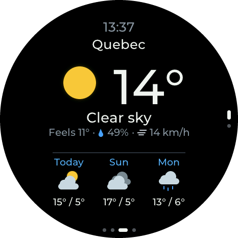</td>
    <td>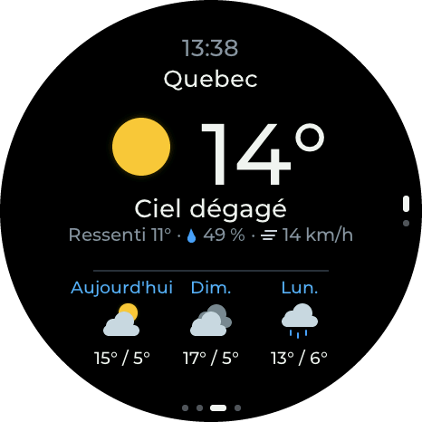</td>
    <td></td>
  </tr>
  <tr>
    <td>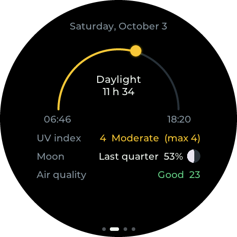</td>
    <td>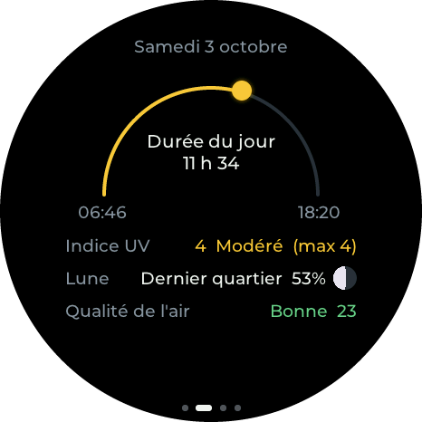</td>
    <td>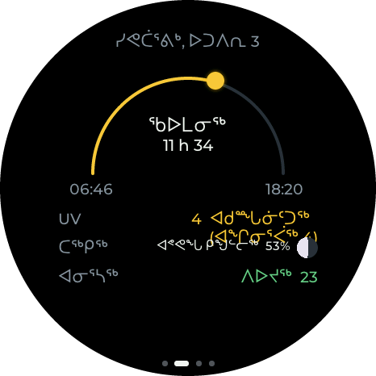</td>
  </tr>
  <tr>
    <td>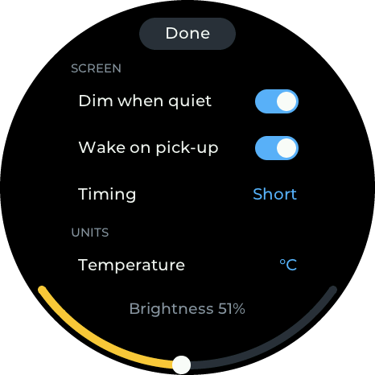</td>
    <td>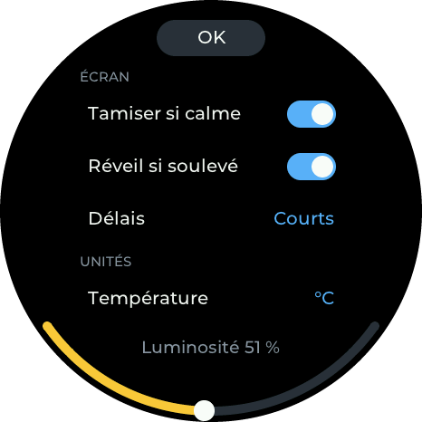</td>
    <td>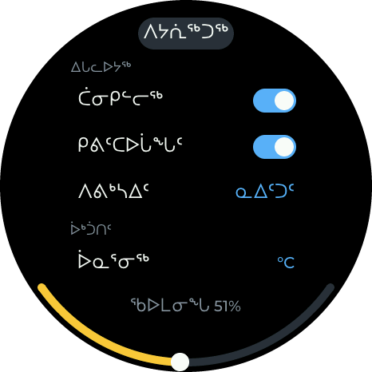</td>
  </tr>
</table>

- One choice for the display and the settings page together: the **Langue / Language** row on the display's Settings
  screen, or the selector in the page's **Units** card.
- Weather alerts come in the chosen language (Environment Canada publishes English and French; Inuktitut shows
  English). The "What's new" notes stay in English.

> [!NOTE]
> The Inuktitut text is a draft that no fluent speaker has reviewed yet, so some words may be wrong. See
> [docs/translations/](docs/translations/).

## 🔄 Updates over Wi-Fi

The display updates itself from the [web flasher site](https://themonkeyz.github.io/esp32-s3-meteobus/):

- It checks a minute after starting and then every 6 hours. When a newer version exists, a blue **Update vX.Y.Z**
  pill appears at the bottom of the weather screen (with a weather alert showing, the alert keeps the pill and gets a
  blue dot). Tap it to see **what's new** since your version, then **Install**. It downloads, restarts, and keeps all settings. Nothing installs without you asking.
- The settings page has a **Firmware** card: installed version, **Updates: Stable releases / Beta (release
  candidates)**, *Check for updates*, what's new, and *Install*, with a progress bar.
- **Beta** follows the flasher's Beta channel (`vX.Y.Z-rc.N` tags) and falls back to Stable when there's no newer
  release candidate.
- Safety: the download is checked for integrity (image header, SHA-256) and must be this project's firmware, at the
  version that was offered, before it's selected. It comes over HTTPS from the project's GitHub Pages site; it isn't
  signed (see [Security notes](#-security-notes)). A new version is kept once it has run for a minute connected to
  Wi-Fi (ten minutes without Wi-Fi); if it restarts before that (crash, boot loop, power cut), the display goes back
  to the previous version by itself and says so on its update screen. A restart asked for during that minute waits
  for it.
- **Coming from the weather display** ([esp32-s3-weather](https://github.com/TheMonkeyz/esp32-s3-weather)): it
  updates from its own site, so it never offers MeteoBus. Install MeteoBus once over USB with the web flasher. With
  *Erase device* unticked it reads the weather display's saved Wi-Fi and settings (it started as that firmware's
  v1.15.0, with the same flash layout); if anything looks wrong, install again with it ticked.

What changed in each version: [CHANGELOG.md](CHANGELOG.md).

## 🌐 Data sources

- Alerts: Environment Canada, [MSC GeoMet OGC API](https://api.weather.gc.ca) `weather-alerts` collection.
- Weather: [Open-Meteo](https://open-meteo.com) (current conditions, 7-day daily and hourly forecast,
  `timezone=auto`).
- Radar: [ECCC MSC GeoMet](https://eccc-msc.github.io/open-data/msc-data/obs_radar/readme_radar_geomet_en/) WMS,
  layer `RADAR_1KM_RRAI` (Canada and the northern US border region, 1 km, every 6 min, last 3 h).
- Lightning: same service, layer `Lightning_2.5km_Density` (Canadian Lightning Detection Network, 2.5 km, every
  10 min, last 3 h, Canada and up to 250 km beyond). Each radar frame shows the flashes of its 10-minute window.
- Basemap: OpenStreetMap standard tiles (zoom 4–10, one level per radar zoom step). After boot, any level that isn't
  cached yet downloads in the background (about 45 s for all 7) and is saved in flash, so zooming is instant
  afterwards. If you open the radar before it's done, a "Preparing maps" panel shows the progress. The radar screen
  credits OpenStreetMap and ECCC; the alert details' map credits OpenStreetMap.

- Buses: the [RTC](https://www.rtcquebec.ca) (Réseau de transport de la Capitale, Québec City), from its website's
  API (`api-iv.rtcquebec.ca`: departures, routes, the buses' positions and the routes' paths) and its notices on
  rtcquebec.ca. The RTC has no public API, and this one is undocumented and may change: this is for personal use.
  The display asks for one stop at a time, at the pace given under [Buses](#buses). The bus map's streets are
  OpenStreetMap tiles (zoom 13–17), downloaded while the map is open and not stored.

In short: the forecast works anywhere in the world; the radar covers Canada and the northern US border region;
weather alerts and lightning cover Canada (lightning up to about 250 km beyond); the buses are Québec City's RTC
only.

## 💻 For developers

Built with **ESP-IDF v5.5.4** (the version CI uses) and **LVGL 9.2.2**, on the
[espforge](https://github.com/TheMonkeyz/espforge) framework. How the pieces fit together:
[docs/ARCHITECTURE.md](docs/ARCHITECTURE.md). How changes are tested on the board: [docs/TESTING.md](docs/TESTING.md).
All the docs: [docs/README.md](docs/README.md). The firmware's screens also run in a browser, compiled to
WebAssembly: [web/emu/](web/emu/README.md).

### On a Mac

[docs/MACOS.md](docs/MACOS.md): `tools/mac/setup.sh` installs everything (ESP-IDF v5.5.4, the page tests, the
emulator), `tools/mac/doctor.sh` checks it, and `tools/flash_helper.py` is the flash helper in Python (same files as
below, so the harness works unchanged).

### Flashing on Windows

The prebuilt binaries go in `firmware/` (they're ignored by git, so you get them from a build). The flashing tool is
`tools/esptool.exe`: standalone esptool **v4.8.1**, downloaded from
https://github.com/espressif/esptool/releases (`esptool-v4.8.1-win64.zip`) and also ignored by git.

Flash layout: bootloader at `0x0`, partition table at `0x8000`, app at `0x10000`, OTA data
(`ota_data_initial.bin`) at `0x610000`. Flash settings: QIO, 80 MHz, 16 MB (the bootloader switches the flash to QIO
itself; esptool's header for it stays `dio`, which is expected).

<details>
<summary><b>flash.bat, monitor.ps1 and the flash helper</b></summary>

- `flash.bat`: flashes `firmware\*.bin` (COM port auto-detected), then logs serial output to `serial_log.txt`.
  - `flash.bat`: interactive, logs for 40 s, then waits for a key press.
  - `flash.bat auto 90`: no pause at the end (for scripts or Claude Code), logs for 90 s.
- `monitor.ps1 -Port <your COM port> -Seconds 60`: serial log only. Press Q or Esc (or create `stop.request`) to stop early.
- `start_flash_helper.bat`: opens the **flash helper** window (`flash_helper.ps1`). Whenever a file named
  `flash.request` appears in this folder, it flashes `firmware\*.bin` and logs serial output for the number of
  seconds written in the file (default 60). This lets tools that can only write files (like the Claude desktop app)
  trigger a flash. The window shows each step live: the request, the esptool upload, **FLASH OK on COMx in N s**
  (with a beep) or **FLASH FAILED** with the last esptool lines, the board's serial output, and a summary (errors,
  warnings, resets). It also writes:
  - `flash.status`: `idle`, `flashing`, `logging` or `flash_failed`.
  - `flash.done`: exit code, port, timings and counts (`stopped_early=1` if the log was cut short).
  - `flash_helper.log`: a running history.

  To end the serial log before its time is up, press **Q** or **Esc** in the window, or create a file named
  `stop.request` (`echo > stop.request`). The log so far is saved and the helper waits for the next request.
  Close the window to stop the helper itself.

</details>

### Diagnostics

`echo 300 > reboot.request` restarts the board through the helper without flashing and records 300 s of log;
`python3 tools/diag_summary.py` then summarises memory, render timing and per-task CPU/stack. Details and
reference numbers: [docs/DIAGNOSTICS.md](docs/DIAGNOSTICS.md). The whole test routine (test builds, flash helper,
logs, screenshots with `tools/snapshot.py`) is in [docs/TESTING.md](docs/TESTING.md).

### Web flasher and automatic builds (GitHub Actions)

The [web flasher](https://themonkeyz.github.io/esp32-s3-meteobus/) has two channels: **Stable** (the latest release) and **Beta** (a release candidate, offered only while it's newer than the
latest release). `?channel=beta` in the address preselects Beta.

`.github/workflows/firmware.yml` builds the firmware with ESP-IDF v5.5.4 on every push and pull request, but only
tags publish anything, and the flasher is assembled from the files attached to the releases, so people install
exactly what was released.

| Event | What happens |
|---|---|
| push to `main`, pull request | build only (compile check); the images are kept as a workflow artifact for testing |
| tag `vX.Y.Z-rc.N` (anything with a `-`) | GitHub **pre-release**; the flasher's **Beta** channel moves to it |
| tag `vX.Y.Z` | GitHub Release; the flasher's **Stable** channel moves to it (and Beta disappears until the next candidate) |
| *Run workflow* on `main` | rebuilds the flasher from the existing releases (after editing `web/flash/index.html`) |

<details>
<summary><b>Releasing a new version, release files, the flasher site and GitHub setup</b></summary>

Releasing a new version: first add a section to [`CHANGELOG.md`](CHANGELOG.md) (`## vX.Y.Z - YYYY-MM-DD`, one
`- ` line per change, written for the person holding the display) and commit it. The display shows the sections
between its version and the offered one before installing.

```
git tag v0.3.0-rc.1                # on the changelog commit; test it from the Beta channel first
git push origin main v0.3.0-rc.1
git tag v0.3.0                     # on the stable changelog commit, once it's good
git push origin v0.3.0
```

- Tags are lightweight. Among pre-releases only `-rc.N` is ordered (by N); other suffixes count below every rc of
  the same version. **Never rename the repository or the account:** every display looks for its updates at the
  Pages address built in (`CONFIG_FORGE_OTA_SITE` in `sdkconfig.defaults`).
- Protect the tags: a repository ruleset on `v*` that only the owner may create or move (a tag is a release, and
  the displays install what it builds).

- The version is `git describe --tags --always` (e.g. `v0.2.0`, `v0.2.0-3-g1a2b3c4` or just a commit hash before
  the first tag). CI writes it to `version.txt`, which ESP-IDF uses as the app version. It appears in the boot log
  (`diag: firmware …`), at the bottom of the settings page and on the flasher page.
- Release assets: `bootloader.bin`, `partition-table.bin`, `ota_data_initial.bin`, `meteobus-<version>.bin`
  (updates keep settings), `meteobus-<version>-full.bin` (merged, flash at 0x0; erases settings) and
  `flash-parts.json` (offsets and version, used to build the flasher).
- The flasher page is `web/flash/index.html` ([ESP Web Tools](https://esphome.github.io/esp-web-tools/)).
  `tools/make_flasher_site.py` has two steps: `dist` turns a build into release files, `site` assembles the page
  with `stable/` and `beta/` folders (each with its images and an ESP Web Tools `manifest.json`), `channels.json`,
  which the page reads for the picker, `notes.json` (the 15 newest `CHANGELOG.md` sections, plain text, shown on the
  display before an update and on the page for the selected version), and `fonts/` (the display's Montserrat font
  from `main/`, so the page matches the display). The pictures are in `web/flash/img/`. The
  images are separate parts (bootloader 0x0, partition table 0x8000, app 0x10000, OTA data 0x610000) so an update
  doesn't wipe NVS (Wi-Fi, location, settings, TLS certificate); a merged image would.
- One-time setup on GitHub: **Settings → Pages → Build and deployment → Source: GitHub Actions**, and
  **Settings → Environments → github-pages → Deployment branches and tags → Add deployment branch or tag rule →
  Tag, `v*`** (by default only `main` may deploy to Pages, which would make releases fail at the Pages step).
- Preview locally after a build: `python3 tools/make_flasher_site.py dist && python3 tools/make_flasher_site.py site
  --stable dist`, then `python3 -m http.server -d _site 8000` and open http://localhost:8000 (Web Serial works on
  localhost).

</details>

### Building from source

Install [ESP-IDF v5.5.4](https://docs.espressif.com/projects/esp-idf/en/v5.5.4/esp32s3/get-started/) (on Windows,
the ESP-IDF installer; then the ESP-IDF PowerShell shortcut, or `. C:\Espressif\esp-idf\export.ps1`), then:

```powershell
git clone https://github.com/TheMonkeyz/esp32-s3-meteobus.git
cd esp32-s3-meteobus
idf.py set-target esp32s3
idf.py build
idf.py -p <your COM port> flash monitor
```

LVGL 9.2.2 and esp_codec_dev are fetched automatically by the component manager (`main/idf_component.yml`). To
refresh the prebuilt files used by `flash.bat`, copy `build\bootloader\bootloader.bin`,
`build\partition_table\partition-table.bin`, `build\ota_data_initial.bin` and `build\meteobus.bin` into
`firmware\` (create it: it isn't in the repository).

### Project layout

<details>
<summary><b>Where everything is</b></summary>

```
main/
  main.c        boot flow, weather refresh loop, reacts to location changes
  display.c     CO5300 QSPI panel driver + LVGL display port (flush, rounder, LVGL task + mutex, raw frames)
  touch.c       CST9217 I2C touch -> LVGL pointer
  ui.c          weather screen, hourly view, bus stop pages, bus map, alert screen, message/QR screens, settings
                overlay, swipe handling
  slide.c       moves between screens, places and days, and list scrolls, drawn from pictures (follow the finger, ~60 fps)
  pager.c       full-screen pages (places, days)
  radar.c       radar screen: basemap tiles + flash cache, GeoMet frames, animation; its task also runs the buses'
                requests and draws the bus map in its idle time (radar_set_side_work, radar_osm_render)
  departures.c  the favourite stops' departures, the routes' notices, the map's buses and path (RTC), polling rules
  rtc_api.c     the RTC's website API: request URLs and reply parsing (host-tested)
  favs.c        the favourite stops in NVS
  bus_routes.c  the settings page's /api/favs and /api/route (My stops)
  netq.c        who is downloading now (the buses wait for the others); Wi-Fi power save off while a map is open
  weather.c     Open-Meteo fetch/parse, WMO code -> text/icon
  alerts.c      Environment Canada weather alerts (MSC GeoMet OGC API)
  routes.c      the settings page's app routes (places, units, sound) and the snapshot hook
  config.c      saved location (NVS) and local-time helper (UTC offset from Open-Meteo)
  audio.c       I2S0 both ways, ES7210 microphones (forge_presence hooks); the speaker side is sound.c
  imu.c         QMI8658 motion sensor (wake on pick-up)
  sound.c       alert beeps through the speaker (ES8311, shares I2S with the microphones)
  i18n.c        the display's texts (i18n_strings.h: English, French, Inuktitut) and the Inuktitut language
  services.c    the outside services (forecast, air, alerts, radar, tiles) for the status page, their texts (the RTC's
                is registered by departures.c)
  console.c     the display's test console commands (simulated touches, fps, pictest...), render bench, "diag: display"
  lvgl_mem.c    LVGL's allocator, in PSRAM (keeps internal RAM for Wi-Fi, DMA and stacks)
  web/index.html  settings page (embedded)
  montserrat.ttf  font, rendered at runtime with LVGL TinyTTF (supports accents like "é"); montserrat-OFL.txt = its license
  syllabics.ttf   Noto Sans Canadian Aboriginal, subset to the syllabics (Inuktitut); syllabics-OFL.txt = its license
partitions.csv  nvs, phy, ota_0 + ota_1 (3 MB each), otadata, mapcache (4 MB: one 512 KB basemap slot per zoom level)
sdkconfig.defaults
main/idf_component.yml  LVGL, the audio codec, and espforge's components at a release tag (since v1.14.0):
                forge_core (diagnostics, test console, language core, text fit, PNG rows), forge_net (Wi-Fi, setup
                network and captive portal, Easy Connect, the HTTPS settings server, service health, the per-device
                certificate), forge_ota (updates over Wi-Fi, rollback), dns_server, forge_presence (screen dimming by
                presence, since v1.15.0): github.com/TheMonkeyz/espforge
docs/README.md        an index of the docs
docs/ARCHITECTURE.md  how the pieces fit together, memory budget, known issues
docs/MERGE-PLAN.md    how the weather and bus displays were merged (the agreed UI and memory plan)
docs/MACOS.md         working on a Mac
docs/DIAGNOSTICS.md   how to measure memory/CPU/render speed, reference numbers, findings
docs/TESTING.md       how changes are tested on the board: test builds, flash helper, logs, screenshots
docs/IDEAS.md         feature ideas / backlog
docs/guide.fr.md      French owner's guide: this README's owner sections, translated (Canadian French)
docs/HISTORY.md       how the project grew (the weather display's history, then MeteoBus), how the work is done,
                      lessons and open threads (start here)
docs/translations/    Inuktitut draft: iu.tsv (the source) and the review sheet
docs/img/hero.png     the picture at the top of this README (tools/make_hero.js)
tools/diag_summary.py summarises the diag: lines of serial_log.txt
tools/snapshot.py     saves a screen as PNG, rendered by the device (GET /api/snapshot); see docs/TESTING.md
tools/round_shots.py  turns harness or snapshot.py screens into round pictures with transparent corners (web/flash/img/)
tools/make_hero.js    builds docs/img/hero.png from those pictures (Playwright, from tools/webtest)
tools/i18n_iu.py      Inuktitut: docs/translations/iu.tsv -> display and page texts, review sheet
tools/webtest/        Playwright tests of the settings page against a mock display (npm test); see docs/TESTING.md
tools/harness/        the whole display tested without a person (screens, page, speed, Wi-Fi setup); see docs/TESTING.md
tools/make_flasher_site.py  release files (dist) and the web-flasher site with Stable/Beta channels (site)
web/flash/            web flasher page (ESP Web Tools) + screenshots
web/flash/img/        screenshots of the screens, used by the flasher page and this README
tests/host/           host unit tests of firmware C code, the RTC's parsing included (gcc, Linux or WSL: make -C
                      tests/host); see docs/TESTING.md
web/emu/              the display in the browser (WebAssembly), shown on the flasher site
.github/workflows/firmware.yml  CI: build, board-free tests, GitHub Pages flasher, releases
.github/dependabot.yml          update proposals for the pinned actions and test tools
flash.bat             Windows: flash firmware\*.bin over USB, then log (COM port auto-detected)
monitor.ps1           serial log to serial_log.txt / serial_live.txt (used by the two below)
flash_helper.ps1      flash.request = flash + log, reboot.request = restart + log (no flashing)
tools/flash_helper.py the same helper for macOS / Linux (docs/MACOS.md); tools/mac/ = Mac setup and doctor
start_flash_helper.bat  starts flash_helper.ps1 (the harness and AI sessions drive the board through it)
CLAUDE.md       notes for AI-assisted development sessions
```

</details>

## 🔒 Security notes

- **Who can change settings.** The settings page shows the settings to anyone on your Wi-Fi, but changing them
  (places, bus stops, units, sound, presence, the saved Wi-Fi network, updates) needs the display's **key**, which only the
  settings QR code on the display carries: being able to see the display is the permission. The key is random,
  made on each board at its first start. The API answers changes only over HTTPS on your network, only to requests
  that name the display itself (no DNS rebinding) and only as JSON with the key header, which a web page from
  another site can't send. The list of favourite stops can be read without the key.
- **The setup network** (*MeteoBus-Setup*) has a password of its own on each display, shown on the display, and uses
  WPA2/WPA3. On it no key is needed (seeing the password is the permission), but it doesn't hand out the places'
  coordinates, the saved network's name or screenshots. It opens by itself for 15 minutes when the saved network is
  unreachable, then only on a press and hold.
- **Updates** come over HTTPS from the project's GitHub Pages site, checked for integrity (SHA-256) and project
  name, but not signed: whoever controls the GitHub account can publish firmware, so keep two-factor
  authentication on it.
- The settings page's TLS certificate is **generated on each board** at first boot (EC P-256, self-signed, valid
  to 2099) and kept in NVS (unencrypted, as are the Wi-Fi password and the key: anyone with the board and a USB
  cable can read them). Browsers warn once because it's self-signed; the certificate name includes the end of the
  board's MAC address. Erasing the flash creates a new one (accept the warning again).
- The bus data is the RTC's, read from its website's undocumented API for personal use (see
  [Data sources](#-data-sources)); the display sends nothing about you to the RTC beyond the stops it asks about.

## 📄 License

MIT, © 2026 Laurent Mathieu. See [LICENSE](LICENSE).
The Montserrat font is under the SIL Open Font License ([`main/montserrat-OFL.txt`](main/montserrat-OFL.txt)), and
so is the syllabics font ([`main/syllabics-OFL.txt`](main/syllabics-OFL.txt)); other bundled and downloaded
components keep their own licenses, listed in [THIRD_PARTY_NOTICES.md](THIRD_PARTY_NOTICES.md).
